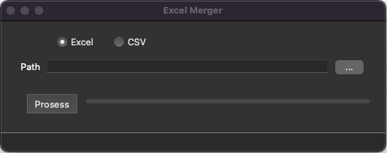

## Preview

## What is xmen 

It is a simple utility written in Python that provide two key features, details below

| Feature        | Use                                                                                         |
| -------------- | ------------------------------------------------------------------------------------------- |
| User Interface | XMen provide easy to use UI to help user easily select available options and track progress |
| Merge          | XMen provide feature to allow merge Excel and CSV files                                     |

## Format File Supported
- XLS
- XLSX
- CSV

## OS Supported
- Windows
- Linux
- MacOS

## How to use xmen

1. Go to the folder where executable is available
2. Once application is loaded, use the checkbox to pick appropriate file type which we want to merge. currently xmen support CSV and Excel files
3. Use path folder selector and pick the folder where individual files are
   NOTE: it is expected that all files must be available in same folder which is picked as part of step 3
4. Click on process button
5. Output will be generated in same directory with name merged.<XLS/XLSX/CSV> depending on choice made

